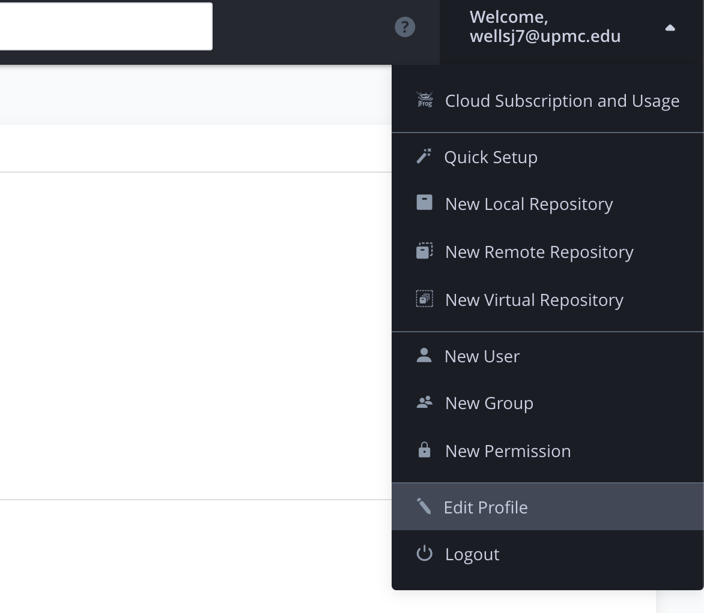
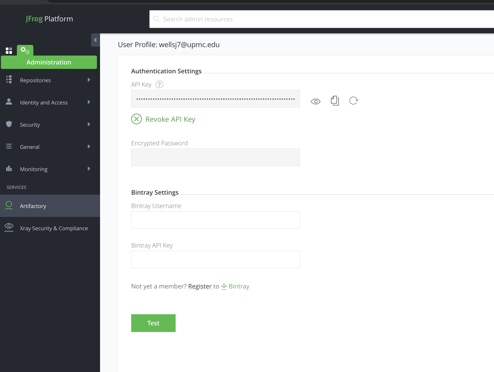

# typescript-package-template

A boilerplate repo for publishing typescript packages to npm...

For reference, this template/project was based off of [this package](https://github.com/93v/npm-typescript-package-boilerplate#readme)

### Instructions

1. clone this repo

2. change package.json:name to your desired scoped library name (eg `@myupmc/parafunctional`)

3. change all references from typescript-package-template repo to your new repo

4. delete or update `README.md` accordingly (as well as the `img` directory)

5. Set up .npmrc so you can access the private npm repo, see *Setting Up Creds*

### Setting Up Creds & Using A Private NPM Repo

1. login to myapps.microsoft.com and click on the `Artifactory` icon

2. In artifactory, click the dropdown with your user/profile name and choose `Edit Profile`

    

3. Create and/or copy your API key.

    

4. Curl artifactory to get your artifactory npmrc config info

    ```
    curl -u {your_email_address_here}:{your_api_key_here} https://upmce.jfrog.io/upmce/api/npm/auth
    ```
    - ** Note: `/api/npm/auth` is not the path to a repo, but rather, the authn endpoint for artifactory npm repos.

    You should get something like the following in response:
    
    ```
    _auth = d2Vsblahblahblahblahblahblahblahblahblahblahblah4eEdIZTJpUnlBOHF3cF
    always-auth = true
    email = wellsj7@upmc.edu
    ```

5. Take the output from that last curl command, and edit your `~/.npmrc` file. 
    -   You will need to manually add the `@myupmc:registry` and `username` properties to the file as well.
        
        -   `@myupmc:registry` should be exactly as you see it below
        -   `username` is your email without `@upmc.edu`  

    -   If `~/.npmrc` does not exist, create it.
    -   This is how it should look:

        ```
        @myupmc:registry = https://upmce.jfrog.io/upmce/api/npm/myupmc
        username = wellsj7
        _auth = d2Vsblahblahblahblahblahblahblahblahblahblahblah4eEdIZTJpUnlBOHF3cF
        always-auth = true
        email = wellsj7@upmc.edu
        ```

6. At this point, `npm install @myupmc/{whatever_package}` should work.

